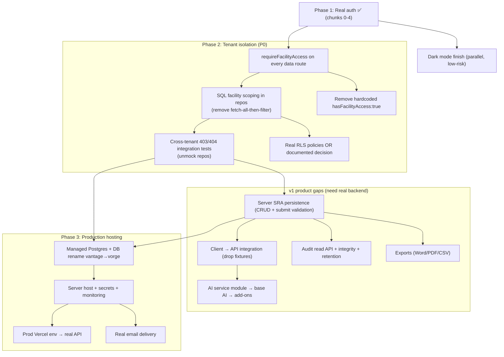

# Vorge SRA — Strategic Roadmap

> **Renamed 2026-07-03:** this file was authored as `docs/roadmap.md` (commit 1c4c82d, audit of 2026-06-04). It was moved here during the 2026-07-03 merge because `docs/roadmap.md` now holds the production-push **execution checklist** (P0–P5, tick-on-completion, bound to `docs/test-specs.md`). This document remains the **strategic retrospective/synthesis**; its audit findings were folded into the execution roadmap's P2 checklist. Where phase numbering differs, the execution roadmap governs.
>
> **Living strategic document.** This is the single retrospective + forward-looking
> map that synthesizes what exists today across `client/`, `server/`, migrations,
> tests, and the canonical docs. It is grounded in code, not aspiration: every
> ✅/🟡 cites a path or test. Extend this doc going forward.
>
> **Authority:** This roadmap *defers* to the canonical sources and never
> contradicts them. For behavior/contract truth read those first:
> `docs/businesslogic.md`, `docs/api-contract.md`, `docs/plan.md`,
> `docs/server-build-plan.md`, `docs/client-build-plan.md`, `AGENTS.md`.
> For the tactical state read `docs/production-status.md` (the map) and
> `SESSION_LOG.md` (the diary). This roadmap stitches them together; it does not
> replace them.
>
> Last audited: **2026-06-04** · Branch `main` · Brand **Vorge** (rebranded from
> Vantage 2026-06-02). Test baseline at audit: **192 server + 144 client = 336
> passing**, coverage gates green (`make test`, exit 0).

---

## 1. Executive snapshot

- **Product:** Vorge is a mobile-first, multi-tenant B2B **Security Risk Assessment** platform that replaces Word-based SRA workflows with structured, multi-user, audit-defensible software (6 roles, 4-state lifecycle, 9 SRA sections, post-approval mitigation tracking). Canonical: `docs/businesslogic.md`.
- **Current phase:** **Phase 1 (real authentication) ✅ complete**; **Phase 2 (tenant-isolation hardening) ⬅ next, not started**; **Phase 3 (production hosting) not started** (`AGENTS.md` → Production push; `docs/production-status.md`).
- **Demo vs prod posture:** The deployed artifact (`vorge-demo-roles.vercel.app`) is the **client running on in-browser fixtures** (`client/src/data/*`, `VITE_ENABLE_DEMO=true`) — a high-fidelity prototype. The **server is real but partially built** (auth is production-grade; assessment/mitigation read + workflow are DB-backed) and is **not yet integrated with the client for SRA content, nor deployed**.
- **Top risk (P0):** Tenant isolation is enforced only by **application-layer JS filtering** in repositories. `requireFacilityAccess` exists but is wired to **no data route**; Postgres **RLS is enabled but has zero policies** (a no-op under the owner DB role); and there is **no cross-tenant integration test on the data routes**. See §4 row "Multi-tenant isolation" and §6.
- **Next milestone:** Finish dark-mode side-quest (shallow, demo-facing) → execute Phase 2 (make `requireFacilityAccess` non-optional, scope repo queries in SQL, add cross-tenant 403/404 tests) → Phase 3 hosting. Work order from `docs/production-status.md`.

---

## 2. Vision & v1 definition of done

**Vision (from `docs/plan.md`, `docs/businesslogic.md`):** a structured, multi-tenant SRA system where the **server is the sole authority** for permissions, facility isolation, workflow state, validation, and audit; the client is a convenience layer that renders server-provided permissions and never grants authority.

**v1 scope (Definition of Done), per `docs/plan.md` + build plans + `docs/businesslogic.md`:**

| Pillar | v1 intent (canonical ref) |
|---|---|
| Auth | Email/password, bcrypt, JWT, refresh, password reset, **TOTP MFA** (required for Admin/Approver/HQ Exec) — `plan.md`, BL §4 |
| Roles | 6 roles (Author, Reviewer, Approver, HQ Executive, Admin, Mitigation Owner), multi-role + audited acting-role switch — BL §3 |
| Lifecycle | Draft → In Review → Awaiting Approval → Approved via server state machine; Approved content frozen except mitigation progress — BL §5 |
| Sections | **9 SRA sections** (Exec Summary, Facility Info, Asset Disaggregation, Threat Assessment, Asset Attractiveness matrix, Vulnerability/Risk Treatment w/ R1/R2, Proposed Mitigation, Conclusion, Appendices) — BL §6 |
| Isolation | `facility_id` on every assessment row + RLS foundations; HQ operator-scoped; Admin cross-facility explicit — `plan.md`, BL §3.4 |
| Audit | Immutable append-only log, hash-chain fields, full action vocabulary; 7-yr retention; + version snapshots on approval — BL §10 |
| Mitigation Owner | Post-approval Open→In Progress→Done (Done requires note, terminal); My Mitigations KPIs — BL §7 |
| Locking | 4 lock types (workflow-state, field-level review, config, facility admin) — BL §11 |
| Library | 5 enterprise libraries, per-facility scope, admin management — BL §12 |
| Admin | Users/roles, risk matrix, libraries, notifications, default teams, mitigation pool, MFA policy, export template — BL §13 |
| HQ dashboard | KPI strip, facility×threat heatmap, drill-down, inconsistency flags — BL §14 |
| Field mode | PWA per-section checkout + offline auth (v1 *foundations*) — BL §8 |
| Exports | Standard Word/PDF + CSV (Approver/Admin) — BL §10.2, build plans |
| AI (6) | Drafted summary (base), anomaly detection (add-on), cross-facility consistency (add-on), semantic library search (base), NL search (bespoke), smart tagging (base) — BL §9 |
| Notifications | Default triggers, role-filtered inbox — BL §15 |

**Explicitly out of scope for v1** (do not build without a trigger; see `docs/considered-and-deferred.md` and BL §9.8 / §4.5):

- SMS MFA (forbidden by MSA 8.3.1); WebAuthn/hardware keys; step-up MFA.
- AI **entity obfuscation/tokenisation**, multi-provider gateway, prompt-management UI, model fine-tuning (BL §9.0).
- **NL search & analytics (AI Feature 5)** — bespoke, **0 build hours in v1**, quote on demand (BL §9.5).
- AI progress-log summarisation; on-prem self-hosting (BL §9.8).
- Full mobile-responsive build (platform is desk-only; demo gets a warning gate instead).
- Per-facility MFA policy editor + configurable lockout thresholds (deferred to "M4-proper").
- Redis-backed rate-limit / TOTP replay cache (required only before multi-instance).

---

## 3. Retrospective — what shipped (by theme)

> Themed synthesis. Do not re-read entry-by-entry — see `SESSION_LOG.md` for the
> chronological diary and `docs/decisions/` for locked decisions.

### Theme A — Authentication (Phase 1, **shipped, production-grade**)
The deepest, most complete area. Real login → JWT (15-min access) → rotating refresh family (httpOnly, `SameSite=Strict`, `Path=/api/auth`) → server-side session revocation → password reset → **TOTP MFA** with enrollment, recovery codes, trusted-device cookie (30d), geometric lockout backoff, and admin-reset.

- **Server:** `server/src/modules/auth/routes.js` (login, me, switch-role, logout, refresh, forgot/reset-password, `mfa/{enroll-start,enroll-verify,verify,verify-recovery,disable,regen-recovery-codes,admin-reset}`); services `sessionService`, `refreshTokenService`, `passwordResetService`, `mfaService`, `mfaPolicy`, `mfaLockoutService`, `mfaTrustDeviceService`, `totpService`, `recoveryCodeService`, `mfaEncryption`; middleware `authenticate.js` (sid claim + MFA gates).
- **Schema:** `202605230001_add_sessions_table`, `…0002_add_refresh_tokens_table`, `…0003_add_password_reset_tokens_table`, `202605260001_add_mfa_user_columns`, `…0002_add_mfa_tables`.
- **Boot guards:** `server/src/config/env.js` throws in production on default `JWT_SECRET` / placeholder `MFA_ENCRYPTION_KEY` / `__MFA_TEST_MODE__`.
- **Tests:** `server/tests/routes.test.js` (login/refresh/logout/switch-role/reset/MFA lifecycles incl. **auth-domain cross-tenant** cases) + per-service unit tests (`server/src/services/*.test.js`).
- **Tags / records:** auth chunks 0–4 (`pre-env-gating` … `pre-mfa-enforcement`); lockbox `docs/decisions/chunk-4-mfa.md`; decisions in `docs/decisions/product-decision-log.md`.
- **Client:** prod auth pages all call the API (`client/src/pages/auth/*`, `client/src/api/client.js`, `client/src/auth/AuthContext.jsx`).

### Theme B — Authorization & 6-role model (shipped, server-authoritative)
Six roles in `server/src/services/constants.js`; per-role permission matrix in `permissionService.js` (read/edit/comment/audit-visibility by role × state); `authorizeRole.js` middleware; audited acting-role switch with refresh-family rotation (`auth/routes.js` `/switch-role`). Client mirrors this for UX in `client/src/features/navigation/navigation.js` + `ProtectedRoute.jsx` (non-authoritative).

### Theme C — Assessment lifecycle & workflow (shipped server-side; richer client reducer)
Server `assessmentStateMachine.js` owns 8 transitions across the 4 states with required-reason + signature-effect + audit-action semantics; enforced in `modules/assessments/routes.js` with optimistic `lock_version` concurrency. Client has a **richer** `workflowReducer.js` (adds a recall-**request**/approve/decline sub-flow + reviewer/approver auto-open tracking) — a known divergence to reconcile when the client wires to the server (see §8). Tested: `server/tests/services.test.js`, client `features/client.test.jsx`.

### Theme D — Mitigation Owner workflow (shipped both sides; client demo-data)
Open→In Progress→Done, Done-requires-note, Done-terminal, post-approval-only, assignment + facility scope. Server `mitigationWorkflowService.js` + `mitigationRepository.js` (`/api/mitigations/{mine,:id/log}`); client `features/mitigationOwner/mitigationRules.js` + `pages/mitigations/MitigationsPage.jsx` with KPIs (open/in-progress/overdue/done-this-year). Tested both sides.

### Theme E — Audit logging (shipped server-side incl. hash chain; client is display)
`auditService.js` computes a SHA-256 hash over a stable-stringified entry **+ previous hash**; `auditRepository.appendAuditLog` chains **per `facility_id`** and inserts append-only. Every workflow transition + auth event writes an entry. **Caveat:** there is **no audit *read* API** and **no tamper-verification routine**; the client audit viewer (`pages/audit/AuditPage.jsx`, `data/auditLog.js`) is display-only over fixtures with **no chain**. Action-vocabulary surfacing strategy is a queued design concern (`AGENTS.md`).

### Theme F — Admin (foundation only)
Server `modules/admin/routes.js` exposes **only** `GET /configuration` (a list of 11 surface names), gated `authenticate` + `authorizeRole(ADMIN)`. Client `pages/admin/AdminPage.jsx` renders all 8 tabs from fixtures with **non-functional** CRUD buttons; `features/admin/MfaResetModal.jsx` has a real `admin-reset` call but is **not wired** into the UI.

### Theme G — Dark mode / theming / brand (~52%, side-quest in progress)
`hooks/useTheme.js` (manual toggle, `vorge-theme` localStorage) + `components/ThemeToggle.jsx` (mounted only in `AppShell`). Auth pages largely tokenized off `zinc-*`; the logged-in shell themes. **Gaps:** no `prefers-color-scheme`; no toggle on auth/MFA routes; ~40+ files still use `zinc-*`/`bg-white`; brand/logo dark treatment only on LoginPage. Extensively recorded in `SESSION_LOG.md` (2026-05-27 → 05-29) and `docs/decisions/product-decision-log.md`.

### Theme H — AI (1 visible slice shipped; rest stub/placeholder)
**AD-1** anomaly acknowledgement on Section 3 assets shipped (client-only, advisory): rule `detectAssetAnomaly` (`data/assets.js`) + `useAnomalyAcknowledgement.js` + `AnomalyWarningChip.jsx` + `AnomalyAcknowledgeModal.jsx`, audit `anomaly-ack`. Other AI features are stubs/heuristics/placeholders (see §4 + §9). **No AI service module, no provider calls, no `/config/ai-providers.yaml`, no cost ceilings** exist yet (BL §9.0 unbuilt).

### Theme I — De-identification & rebrand (shipped)
Demo facilities de-identified (2026-06-01). Full **Vantage→Vorge** rebrand (2026-06-02): ~325 hits/~80 files, new logo SVGs/favicon, client storage-key migration shim (`config/legacyStorageMigration.js` + `storageKeys.js`), server legacy-cookie dual-read. Intentional legacy kept: **DB name `vantage`** in `env.js`/`knexfile.js` default `DATABASE_URL`; `.env.example` untouched; Drive `.docx` references. Records: `SESSION_LOG.md` 2026-06-01/02, `product-decision-log.md`.

### Theme J — Demo deployment (shipped, manual)
Client deployed to `vorge-demo-roles.vercel.app` via manual `vercel --prod` (root dir `client`, `VITE_ENABLE_DEMO=true`); git auto-deploy intentionally disconnected. Demo-mode mobile warning gate (`components/demo/DemoMobileGate.jsx`) + Author-dashboard whole-row tap target shipped for phone QA. Records: `SESSION_LOG.md` 2026-05-28.

---

## 4. Current state matrix

Legend: ✅ done · 🟡 partial / needs work · ⬜ not started · 🔴 P0 risk · ❓ unverified.
Confidence = how strongly the audit verified the row (H/M/L). "Posture" notes demo-only vs production-ready where it matters.

| Capability area | v1 intent | Status | Conf. | Evidence (paths) | Gaps / risks | Priority |
|---|---|---|---|---|---|---|
| **Auth: login/JWT/refresh** | Email+pw, JWT, rotating refresh family | ✅ | H | `modules/auth/routes.js`; `services/{session,refreshToken}Service.js`; `tests/routes.test.js` (login/refresh/logout) | Forgot-password not rate-limited (TODO in `routes.js` L458) | P2 |
| **Auth: password reset** | Forgot/reset + session invalidation | ✅ | H | `passwordResetService.js`; `tests/routes.test.js` reset lifecycle | Email delivery is a stub (`emailService.js`) — needs real provider for prod | P1 |
| **Auth: TOTP MFA** | Enroll, verify, recovery, trust-device, lockout, admin-reset | ✅ | H | `mfaService.js`, `mfa*Service.js`, `chunk-4-mfa.md`; `tests/routes.test.js` MFA lifecycle | Per-role hardcoded (Admin/Approver/HQ); policy editor deferred ("M4-proper") | P2 |
| **Auth: demo gating** | Personas dev-only, not in prod | 🟡 | H | `client/src/auth/demoFlag.js` (`VITE_ENABLE_DEMO==="true"`), `session.js` `assertDemoEnabled`, `Makefile` `dev-prod`; `auth/demoFlag.test.js` | **Gated by `VITE_ENABLE_DEMO`, not `import.meta.env.DEV`** as `AGENTS.md` invariant #2 states — reconcile wording vs mechanism | P1 |
| **Authorization & 6-role model** | 6 roles, audited switch | ✅ | H | `constants.js`, `permissionService.js`, `authorizeRole.js`, `/switch-role`; `services.test.js` | — | — |
| **Multi-tenant / facility isolation** | `facility_id` scoping + RLS + middleware | 🔴 | H | middleware `requireFacilityAccess.js` **exists but unused**; scoping done in JS in `assessmentRepository.js`/`mitigationRepository.js` via `facilityAccessService.canAccessFacility`; RLS enabled w/ **no policies** (`202605020001_initial_schema.js` L161-169; comment in sessions migration) | **P0:** no route-level `requireFacilityAccess`; `listAssessmentsForUser` fetches all rows then filters in JS; mitigation route hardcodes `hasFacilityAccess:true` (`routes.js` L49); RLS no-op under `postgres` owner; **no data-route cross-tenant test** | **P0** |
| **Assessment lifecycle** | 4-state server machine | ✅ (server) / 🟡 (client) | H | `assessmentStateMachine.js` (8 transitions); `modules/assessments/routes.js` (lock_version); client `workflowReducer.js` | Client reducer richer than server (recall-request flow) — reconcile on integration; optimistic-concurrency race is a queued concern | P1 |
| **9 SRA sections** | All 9 incl. matrix + R1/R2 | 🟡 | H | client `features/assessmentWorkspace/sections/*` (all 9); server `SECTION_NAMES` in `assessmentRepository.js` L4-14 | Section editing has **no server persistence endpoints** (no asset/threat/evaluation CRUD routes); client edits are in-memory fixtures | P1 |
| **Comments** | Inline (Reviewer) + assessment (HQ) | 🟡 | H | `permissionService.canComment`; client `CommentAffordance.jsx`, `WorkspaceContext.addComment` | No server comment endpoint/table; client-only | P1 |
| **Locks (4 types)** | Workflow/field/config/facility | 🟡 | M | workflow-state lock via `permissionService.canEditContent` (Author+Draft); client shows `locks.reviewerLockedFields` (display) | Field/config/facility locks **not implemented**; no lock/unlock UI or endpoint | P2 |
| **Recall / withdraw / validation** | Author withdraw, Reviewer recall, validation gating | 🟡 | H | server transitions `withdraw_to_draft`, `recall_review_completion`; client `RecallModal`, `sectionValidation.js`, `ValidationSummary.jsx` | Validation is client-side only; server doesn't re-validate section completeness on submit | P1 |
| **Mitigation Owner workflow** | Post-approval Open→IP→Done | ✅ (logic) / 🟡 (data) | H | `mitigationWorkflowService.js`, `mitigationRepository.js`, `/mitigations/*`; client `mitigationRules.js`, `MitigationsPage.jsx`; tests both sides | Client uses fixtures; not wired to API | P1 |
| **Audit logging** | Immutable + hash chain + vocab | 🟡 | H | `auditService.js` (sha256 + previousHash), `auditRepository.js` (per-facility chain, append-only insert); schema `audit_log_entries` | **No audit read API**, no tamper-verify routine, no DB-level UPDATE/DELETE prevention (trigger/RLS), no retention job; client viewer has no chain | P1 |
| **Version history** | Snapshot on approval | 🟡 | M | `assessmentRepository.createVersionSnapshot` (on APPROVE); `versions` table | No read/compare API; client `VersionsModal` is a stub ("Available with server backend") | P2 |
| **Admin (users/facilities/dropdowns)** | 8 config surfaces, CRUD | 🟡 | H | server `modules/admin/routes.js` (`GET /configuration` list only); client `AdminPage.jsx` (8 tabs, fixtures) | No admin CRUD endpoints; client buttons inert; `MfaResetModal` unwired | P2 |
| **Field mode / offline** | PWA per-section checkout (v1 foundations) | ⬜/🟡 | H | client `pages/fieldMode/FieldModePage.jsx`, `FieldModeModal.jsx`, `features/fieldMode/offlineModel.js` | **Simulated only** — no service worker, manifest, or IndexedDB; "v1 foundations" = messaging UX | P2 |
| **Exports (Word/PDF/CSV)** | Standard Word/PDF; CSV for Approver/Admin | ⬜ | H | none — only `alert()` stubs (`HQExecutiveDashboard.jsx`, `AuditLogPanel.jsx`); no `docx`/`pdf` lib in `client/package.json`; no server export route | Entire capability **absent** | P1 |
| **AI Feature 1 — drafted summary** | Author-only draft for §1/§8 | 🟡 | H | client `modals/AIDraftModal.jsx` (template, fake 700ms) | Stub; no server endpoint, no LLM call | P2 |
| **AI Feature 2 — anomaly detection** | Advisory flag→ack→audit (add-on) | 🟡 | H | `detectAssetAnomaly` (`data/assets.js`), `useAnomalyAcknowledgement.js`, `AnomalyWarningChip.jsx`; tests `assets.test.js`, `AssetDisaggregationSection.test.jsx` | AD-1 only (§3 rule, client, advisory). AD-2+ (server engine, debounce, §5/§6) not started | P2 |
| **AI Feature 3 — cross-facility consistency** | Nightly batch + HQ flags (add-on) | ⬜ | H | hardcoded `flags` in `HQExecutiveDashboard.jsx` | Placeholder data only; no batch job, no stats, no LLM rationale | P2 |
| **AI Feature 4 — semantic library search** | pgvector embedding search (base) | 🟡 | M | client `data/library.js` `similarity()` (token overlap), `LibraryModal.jsx`, `EvaluationSection.jsx` suggestions | Client heuristic, not embeddings; no pgvector, no server search | P2 |
| **AI Feature 5 — NL search/analytics** | Bespoke text-to-SQL | ⬜ | H | substring match only (`AssessmentsListPage.jsx`) | Intentionally **0 hrs v1** (BL §9.5) | — |
| **AI Feature 6 — smart tagging** | Suggest tags from vocab (base) | ⬜ | M | tags pre-seeded in `data/library.js`; displayed only | No suggestion logic, no controlled-vocab service | P2 |
| **AI service module (shared)** | Provider routing, cost ceilings, audit | ⬜ | H | none found | Entire foundation (BL §9.0) unbuilt; gates all "real" AI | P1 (if AI prioritized) |
| **Notifications** | Triggers + role-filtered inbox | 🟡 | H | client `NotificationsPage.jsx`, `notificationModel.js`, `data/notifications.js` | Display over fixtures; no triggers, no server, no push/poll | P2 |
| **Dark mode / theming / auth polish** | App-wide theming incl. auth | 🟡 (~52%) | H | `hooks/useTheme.js`, `ThemeToggle.jsx`; `pages/auth/*` tokenized | No `prefers-color-scheme`; no toggle on auth routes; ~40+ files still `zinc-*`/`bg-white` | P1 |
| **Production hosting (Phase 3)** | Managed PG, host, secrets, monitoring, retention | ⬜ | H | `docker-compose.yml` (local only); `env.js` guards | Nothing hosted; client+server not integrated/deployed together | P1 |
| **Test & quality gates** | 95% server services; 80% client logic | ✅ | H | `server/package.json` jest (`src/services/**`, 95%); `client/vite.config.js` (80%, `auth`/`features/*.js`/`routes/*.jsx`) | Client gate scope is narrow (logic only; not pages/`.jsx` sections). No coverage script alias on client (`npm test` ≠ coverage) | P2 |
| **Demo deployment (Vercel, personas)** | Navigable role demo | ✅ | H | `vorge-demo-roles.vercel.app`; `DemoMobileGate.jsx`; `SESSION_LOG.md` 2026-05-28 | Manual deploy; client-only (no server) | — |

---

## 5. Roadmap horizons

Each item: **outcome** · why · dependency · size (S/M/L) · priority.

### Now (0–4 weeks) — committed, aligned with `docs/production-status.md` work order

1. **Finish dark mode** — *outcome:* consistent theming across the demo incl. auth routes. Why: visible, demo-facing, low-risk quick win + most prominent gap. Dep: none. **M · P1.**
   - `prefers-color-scheme` in `useTheme`; theme toggle on login/MFA routes; sweep remaining `zinc-*`/`bg-white` (Chunk B + dashboards/workspace/admin).
2. **Reconcile demo-gating wording** — *outcome:* `AGENTS.md` invariant #2 and `demoFlag.js` agree (either adopt `VITE_ENABLE_DEMO` officially or add `import.meta.env.DEV`). Why: security invariant clarity. Dep: none. **S · P1.**
3. **Phase 2 kickoff: route-level facility enforcement** — *outcome:* `authenticate` **and** `requireFacilityAccess` on every data route. Why: P0 defense-in-depth. Dep: none. **S–M · P0.** (See §6.)

### Next (1–2 quarters) — Phase 2, Phase 3, remaining v1 gaps

4. **Phase 2 complete — tenant isolation hardening** — *outcome:* SQL-level `facility_id` scoping in every repo query; cross-tenant 403/404 integration tests on assessments + mitigations; real RLS policies (or a documented owner-role decision). Why: highest-severity correctness/security. Dep: #3. **L · P0.**
5. **Server SRA persistence layer** — *outcome:* CRUD endpoints for assessments/assets/threats/links/evaluations/comments + server-side submit validation; replace client fixtures with API calls (`WorkspaceContext` → `api/client`). Why: client is a prototype until this lands. Dep: #4 (scoping must exist first). **L · P1.**
6. **Audit read + integrity** — *outcome:* audit read API (role-scoped per BL §10.2), DB-level append-only enforcement (trigger/RLS), tamper-verify routine, retention policy. Why: audit-defensibility is core value. Dep: #5. **M · P1.**
7. **Exports** — *outcome:* Word/PDF assessment export + CSV (Approver/Admin), export action audited. Why: explicit v1 DoD; absent today. Dep: #5. **M · P1.**
8. **Email delivery (prod)** — *outcome:* real transactional email for password reset. Dep: Phase 3 secrets. **S · P1.**
9. **Phase 3 — production hosting** — *outcome:* managed Postgres, server host, secrets mgmt, error monitoring, audit retention, prod Vercel envs pointing at the real API; **DB rename `vantage`→`vorge`** during the fresh-DB migration. Why: deploy-infra capstone. Dep: #4. **L · P1.**

### Later (v1.1+ / nice-to-haves)

10. **AI service module + base AI features** (drafted summary, semantic search via pgvector, smart tagging) — outcome: real AI per BL §9.0/§9.1/§9.4/§9.6. Dep: server persistence. **L · P2.**
11. **AI add-ons** — anomaly engine (AD-2+: server, debounce, §5/§6), cross-facility consistency batch (AD-4). Dep: #10. **L · P2.**
12. **Locks (field/config/facility)**, **version compare UI**, **notifications triggers/delivery**, **field-mode real PWA/offline**. **M each · P2.**
13. **Admin CRUD** (users/facilities/dropdowns), **per-facility MFA policy editor** ("M4-proper"). **M–L · P2.**
14. **Per-dashboard tap targets** (Reviewer/Approver/HQ/MO), **deep-link validation to matrix cell**, **section-completion derivation model**. **S–M · P2.**
15. **Platform Console (owner/consultant)** — *outcome:* an owner-facing console SEPARATE from customer Admin: new-tenant provisioning (operator → facility → first Admin, seeded from BL §19 defaults), a cross-client portfolio dashboard, and audited support access. New `PLATFORM_OWNER` role + `/platform/*` namespace; must not weaken tenant isolation. Scheduled as **P4.5** in `docs/roadmap.md` (after the AI module). Precursor: the staging onboarding kit/script. Open decision: impersonate-into-client vs link-only support. Dep: #4 (isolation) + server persistence. **L · P2 — NEEDS DECISION.** *(Placeholder — to be written out properly.)*

### Deferred (parked — see `docs/considered-and-deferred.md`)

SMS MFA (permanent), WebAuthn, step-up MFA, configurable lockout thresholds, full MFA-table RLS, Redis rate-limit/replay, `users.mfa_enabled` column drop, chunk 0–3 lockbox backfill, PR workflow, full mobile-responsive build, gold-CTA app-wide + token, mark-only logo, fac-4/fac-5 rename + full geo-anonymization, `website/` rebrand, Drive `.docx` renames, infra renames (GitHub/Vercel/dir). NL search & analytics (AI #5) is bespoke/on-demand.

---

## 6. Engineering enablers (non-user-facing work that unlocks production)

These gate Phase 2/3 and are mostly invisible to users but are the critical path.

- **P0 — Route-level facility enforcement.** Apply `requireFacilityAccess` (`server/src/middleware/requireFacilityAccess.js`) to `modules/assessments/routes.js` and `modules/mitigations/routes.js`. Today both use only `authenticate`. AGENTS.md invariant #1: *"Every data route must use both `authenticate` and `requireFacilityAccess`."*
- **P0 — Repository SQL scoping.** Replace fetch-all-then-filter (`listAssessmentsForUser` selects every assessment then `.filter()`s in JS) with `WHERE facility_id IN (…scope)` predicates. Add a defense-in-depth `facility_id` predicate to the bundle sub-queries in `getAssessmentBundleById`.
- **P0 — Remove the hardcoded bypass.** `modules/mitigations/routes.js` L49 passes `hasFacilityAccess: true` to `transitionMitigation`; derive it from `canAccessFacility` instead (repo gate currently covers it, but the route asserts a value it didn't check).
- **P0 — Cross-tenant integration tests for data routes.** `tests/routes.test.js` proves auth-domain isolation but **mocks** `assessmentRepository`/`mitigationRepository`, so the data-path filter is never exercised end-to-end. Add tests proving Tenant A cannot read/transition Tenant B's assessment/mitigation (expect 403/404), per AGENTS.md invariant #1.
- **P1 — Real RLS or a documented decision.** Initial schema enables RLS on 7 tables with **zero policies**; the app connects as the `postgres` owner (default `DATABASE_URL`), so RLS is a no-op. Either write session-aware policies + connect as a non-owner role, or formally record app-layer-only enforcement (current `considered-and-deferred.md` posture) — but don't leave "RLS foundations" implying protection it doesn't provide.
- **P1 — Audit hardening.** DB-level UPDATE/DELETE prevention (trigger or RLS) on `audit_log_entries`; a hash-chain verification routine; retention job (7-yr default, BL §10).
- **P1 — Secrets & monitoring (Phase 3).** Production `JWT_SECRET`/`MFA_ENCRYPTION_KEY` provisioning (guards already enforce non-default), error monitoring, managed Postgres, prod cookie `Secure`/domain config.
- **P2 — Multi-instance readiness.** Migrate `express-rate-limit` in-memory store + TOTP replay cache to Redis before any horizontal scale (`considered-and-deferred.md`).
- **P2 — Migrations discipline.** Continue explicit `make migrate`; never edit shipped migrations; plan the `vantage`→`vorge` DB rename as a new (destructive) migration tied to Phase 3.
- **P2 — Seed fix.** `npm run seed` fails on `assessments.contributors` JSONB before any dev DB reset (`considered-and-deferred.md`).

---

## 7. Dependencies & sequencing

Aligned with `AGENTS.md` Phases 1–3. Phase 1 ✅ done.

Critical path to a *real* product: **Phase 2 isolation → server persistence → client/API integration → Phase 3 hosting.** Dark mode and the demo run in parallel and don't block.

---

## 8. Open questions & pending decisions

From `docs/plan.md` open questions, `production-status.md` follow-ups, `product-decision-log.md`, and `AGENTS.md` "known design concerns":

1. **Audit-log surfacing strategy** — filtered per-role recent activity vs full audit log; permission scoping for filtered audit queries (AGENTS.md). *Blocks audit read API design.*
2. **Optimistic concurrency for recall** — race between Author recall-immediate and Reviewer opening when the server lands; note the **client reducer's recall-request flow is richer than the server state machine** — pick one model on integration (AGENTS.md; §3 Theme C).
3. **Demo-gating mechanism** — `AGENTS.md` says `import.meta.env.DEV`; code uses `VITE_ENABLE_DEMO`. Decide the canonical gate (§4).
4. **RLS policy vs app-layer** — write real policies + non-owner DB role, or formalize app-layer-only? (§6).
5. **Hash-chain mandate** — BL §10.1 leaves "v1 vs hardening" as a `TODO`; code already chains. Confirm v1 requires it (it's built) and add verification.
6. **Seed normalization** — denormalized `assessmentState` on mitigations vs normalized (AGENTS.md).
7. **Internal `version`/`lock_version` field** — clean up or repurpose (AGENTS.md).
8. **Production Author landing section** — resume at last-viewed vs hardcoded §2 (`production-status.md`; `product-decision-log.md` 2026-05-28).
9. **Critical-severity dark text** — designer sign-off on the `#FF5C61` WCAG override (passes AA today; non-code blocker).
10. **Library scope** — per-facility only vs operator-template inheritance (`plan.md`).
11. **HQ dashboard refresh cadence**; **per-user notification preferences in v1**; **workflow variants** (dual approvers / HQ high-risk approval) (`plan.md`).
12. **AI provider & obfuscation details** — provider choice per feature; v1 sends real entity names (no obfuscation) (`plan.md`, BL §9.0).

---

## 9. Feature inventory appendix

Epic-level map: **feature → client route/component → server module/route → repository → test(s)**. `—` = not implemented on that side. "fixtures" = `client/src/data/*`.

| Feature | Client route / component | Server module / route | Repository | Test(s) |
|---|---|---|---|---|
| Login / session | `/login` `pages/auth/LoginPage.jsx`, `auth/AuthContext.jsx`, `api/client.js` | `auth` `POST /login`, `GET /me` | `userRepository`, `sessionRepository` | `tests/routes.test.js`; `sessionService.test.js`; client `features/auth/*` |
| Refresh / logout | `auth/AuthContext.jsx` (auto-refresh) | `auth` `POST /refresh`, `/logout` | `refreshTokenRepository`, `sessionRepository` | `tests/routes.test.js`; `refreshTokenService.test.js` |
| Role switch | `AppShell` role switcher; `navigation.js` | `auth` `POST /switch-role` | `userRepository`, `refreshTokenRepository` | `tests/routes.test.js`; client `client.test.jsx` |
| Password reset | `/forgot-password`, `/reset-password` | `auth` `POST /forgot-password`, `/reset-password` | `passwordResetTokenRepository` | `passwordResetService.test.js`; client `passwordReset.test.jsx` |
| MFA (TOTP) | `/mfa/{verify,enroll,lockout}`, `/settings/mfa` | `auth` `/mfa/*` (7 endpoints) | `mfaSecret/RecoveryCode/TrustedDevice` repos | `mfa*Service.test.js`; `tests/routes.test.js`; client `mfa.test.jsx` |
| Dashboards (6 roles) | `/dashboard` `pages/dashboards/*` | — (fixtures) | — | client `AuthorDashboard.test.jsx`, `client.test.jsx` |
| Assessments list | `/assessments` `AssessmentsListPage.jsx` | `assessments` `GET /` | `assessmentRepository.listAssessmentsForUser` | `tests/routes.test.js`; `services.test.js` |
| Assessment workspace (9 sections) | `/assessments/:id/sections/:n` `assessmentWorkspace/sections/*` | `assessments` `GET /:id` (read bundle) | `assessmentRepository.getAssessmentBundleForUser` | `tests/routes.test.js`; client `client.test.jsx` |
| Workflow transitions | `workflowReducer.js`, `modals/{Submit,Decision,Recall}` | `assessments` `POST /:id/workflow` | `assessmentRepository.updateAssessmentState` + `auditRepository` | `assessmentStateMachine` in `services.test.js`; `tests/routes.test.js` |
| Section validation | `sectionValidation.js`, `ValidationSummary.jsx` | — (server submit re-validation TODO) | — | client `client.test.jsx` |
| Comments | `CommentAffordance.jsx`, `WorkspaceContext.addComment` | — | — | `permissionService` in `services.test.js` (rules only) |
| Mitigation Owner | `/mitigations` `MitigationsPage.jsx`, `mitigationRules.js` | `mitigations` `GET /mine`, `POST /:id/log` | `mitigationRepository` | `mitigationWorkflowService` in `services.test.js`; `tests/routes.test.js`; client `client.test.jsx` |
| Audit | `/audit` `AuditPage.jsx`, `modals/AuditLogPanel.jsx`, `auditVisibility.js` | — (write-only via `appendAuditLog`; no read route) | `auditRepository` | `auditService` in `services.test.js`; client `client.test.jsx` |
| Versions | `modals/VersionsModal.jsx` (stub) | created in `POST /:id/workflow` (on approve) | `assessmentRepository.createVersionSnapshot` | `services.test.js` (indirect) |
| Admin | `/admin` `AdminPage.jsx` (8 tabs), `MfaResetModal.jsx` | `admin` `GET /configuration`; `auth /mfa/admin-reset` | — | `tests/routes.test.js` (admin-reset cross-tenant) |
| Field mode | `/field-mode` `FieldModePage.jsx`, `FieldModeModal.jsx`, `fieldMode/offlineModel.js` | — | — | client `client.test.jsx` (offline messaging) |
| Notifications | `/notifications` `NotificationsPage.jsx`, `notificationModel.js` | — | — | client `client.test.jsx` |
| Exports | `alert()` stubs only | — | — | — |
| AI — drafted summary | `modals/AIDraftModal.jsx` (stub) | — | — | — |
| AI — anomaly (AD-1) | `useAnomalyAcknowledgement.js`, `AnomalyWarningChip.jsx`, `AnomalyAcknowledgeModal.jsx`, `data/assets.js` | — (client-only, advisory) | — | `assets.test.js`, `AssetDisaggregationSection.test.jsx` |
| AI — cross-facility / NL / tagging | placeholder data / substring / pre-seeded | — | — | — |
| AI — semantic library search | `data/library.js` `similarity()`, `LibraryModal.jsx` | — | — | — |
| Risk matrix (R1/R2) | `riskMatrix.js`, `EvaluationSection.jsx` | `riskMatrixService.js`, `sectionRelationshipService.js` | — | `services.test.js`; client `client.test.jsx` |
| Theming | `hooks/useTheme.js`, `ThemeToggle.jsx` | — | — | client `styles/index.css.test.js` |
| Rebrand migration | `config/legacyStorageMigration.js`, `storageKeys.js` | `env.js` legacy cookie dual-read | — | client `legacyStorageMigration.test.js` |

---

## 10. Maintenance instructions

**When to update this doc**
- A capability changes status in the §4 matrix (e.g., a Phase 2 enabler lands, a server endpoint ships, exports get built).
- A horizon item (§5) moves between Now/Next/Later/Deferred, or a new epic appears.
- An open question (§8) is decided — move it into a decision record and update the matrix.
- After any change that touches `client/src/`, `server/src/`, or `server/migrations/` and materially shifts the picture (per `CLAUDE.md` doc-update rule).

**How it relates to the other planning layers**
- `SESSION_LOG.md` = **diary** (append-only, chronological, what-happened). This roadmap **synthesizes themes** from it; it does not duplicate entries.
- `docs/production-status.md` = **tactical map** (current Phase state + work order). This roadmap is the **strategic superset** (vision → retrospective → matrix → horizons). When they disagree, fix both; `production-status.md` is the faster-moving tactical truth.
- `docs/businesslogic.md` / `docs/api-contract.md` = **canonical behavior/contract**. This roadmap must never contradict them (and must not be edited to do so).
- `docs/considered-and-deferred.md` = the parking lot the §5 "Deferred" bucket links to.
- `docs/decisions/` = locked decisions; cite them rather than restating.

**Status legend** (used in §4): ✅ done · 🟡 partial / needs work · ⬜ not started · 🔴 P0 risk · ❓ unverified. Confidence H/M/L = audit strength. Always cite at least one path/test for ✅ or 🟡.

**Review cadence (suggested):** light review at the **start of each chunk/work session** (re-confirm the Now bucket); a **full re-audit at each phase boundary** (Phase 2 complete, Phase 3 complete) — re-run `make test`, re-verify the §4 matrix against code, and refresh the test baseline line at the top.
